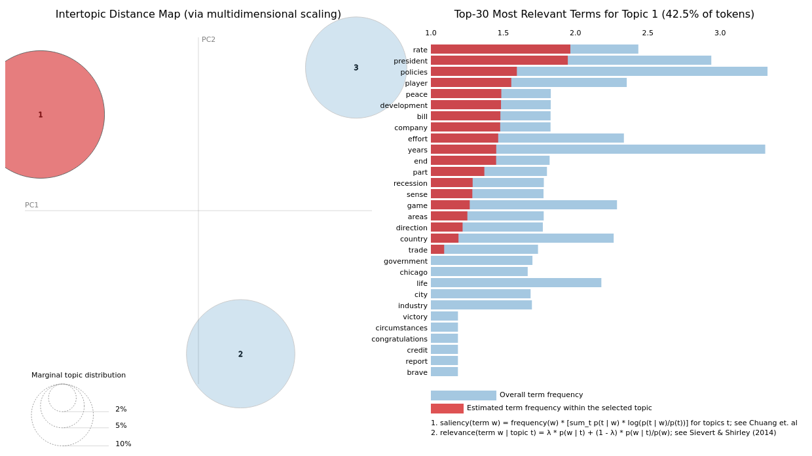

# Results

This folder contains the files produced during our initial data analysis.

## ldavis_prepared_3.html

This file contains the topics from the second week of november. As shown in the clusters below. The full interactive representation can be found in the html file.

Just in case there is a problem with the html file, here is the link to the public Colab notebook which is prerun and contains the interactive plot: https://colab.research.google.com/drive/1Fw9UwZBmCiHWnQG0gksY0ak28XI406Qn?usp=sharing
